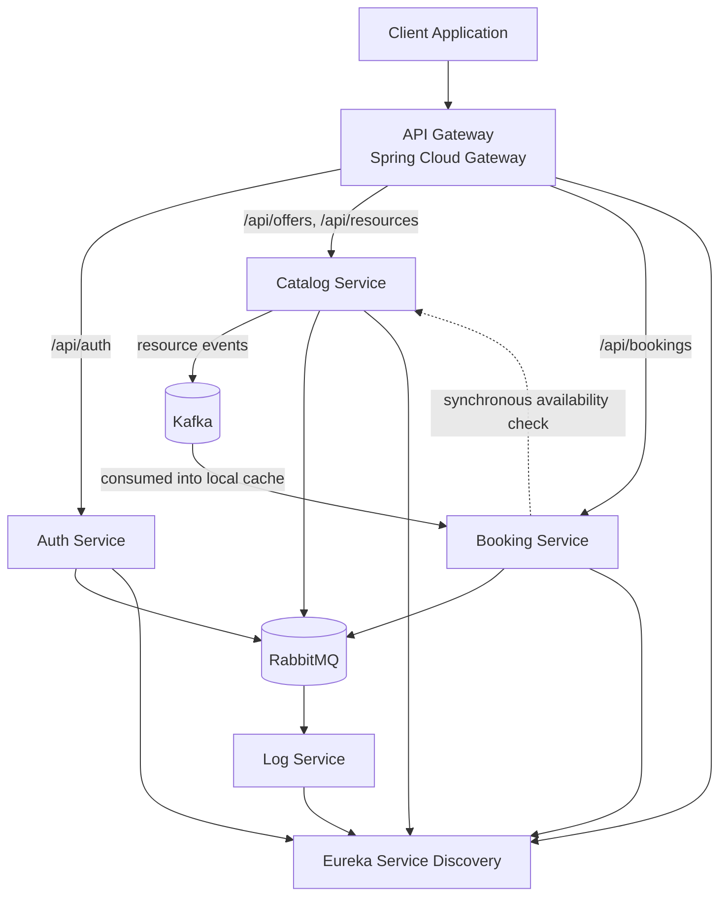

> **V2 — Production-Ready Backend (nearly complete).**
> Built on top of [SmartBookingPlatform V1](https://github.com/LeonilSulude/SmartBookingPlatform_V1), which is stable and documented.
> V2 matures V1's architecture across correctness, security, testing, and observability. Full write-up in [`report/V2_SmartBookingPlatform`](report/V2_SmartBookingPlatform).

# SmartBookingPlatform

A **microservices-based booking platform** built with **Spring Boot and Spring Cloud**, demonstrating a production-oriented backend architecture: service discovery, API gateway routing and RBAC, a Kafka hybrid event/sync model, real integration and contract testing, observability, and a CI pipeline that actually gates on all of it.

> Originally a learning and architecture exercise exploring distributed systems concepts commonly used in production environments — V2 pushes those concepts from "demonstrated" to "verified."

---

## Features

- Microservices architecture, database-per-service
- API Gateway routing with role-based authorization (PROVIDER / CLIENT / ADMIN)
- Stateless JWT authentication
- Service discovery with Eureka
- Kafka hybrid model — asynchronous replication of stable data, synchronous calls only where real-time accuracy matters
- Optimistic locking and an idempotency key for booking concurrency
- Flyway-managed schema migrations
- Resilience4j retry, circuit breaker, and time limiter on inter-service calls
- Centralized logging over RabbitMQ with correlation ID propagation
- Observability: Prometheus, Grafana, and distributed tracing with Zipkin
- Integration tests with Testcontainers (real Postgres, Kafka, RabbitMQ) across every service
- Consumer-driven contract tests with Pact — HTTP and Kafka message contracts, with real provider verification
- End-to-end tests against the full running stack
- GitHub Actions CI: unit and integration tests in a matrix over all six services, gated so integration testing only runs once every service's unit tests pass
- Load testing with k6

---

## Table of Contents

- [Architecture Overview](#architecture-overview)
- [Technologies Used](#technologies-used)
- [API Gateway Routing](#api-gateway-routing)
- [Authentication Flow](#authentication-flow)
- [API Documentation](#api-documentation)
- [Running the Platform](#running-the-platform)
- [Testing](#testing)
- [Continuous Integration](#continuous-integration)
- [Load Testing](#load-testing)
- [Project Structure](#project-structure)
- [Design Principles](#design-principles)
- [Roadmap](#roadmap)

---

## Architecture Overview

The platform follows a microservices architecture where each service owns a specific business capability and its own PostgreSQL database. Services communicate synchronously via OpenFeign where real-time accuracy is required, and asynchronously via Kafka where eventual consistency is acceptable — stable resource data (name, price, duration) is replicated from Catalog to Booking as events, while availability checks stay synchronous.

| Service | Responsibility |
|---|---|
| **API Gateway** | Single entry point — routing, JWT validation, and RBAC enforcement |
| **Auth Service** | User registration and JWT authentication |
| **Catalog Service** | Service offers and resources; publishes resource lifecycle events to Kafka |
| **Booking Service** | Booking creation, availability, and cancellation; consumes Catalog's Kafka events into a local cache |
| **Log Service** | Centralized log ingestion from RabbitMQ |
| **Discovery Service** | Service registry using Netflix Eureka |

### System Diagram



All services register with Eureka and are resolved dynamically at runtime; the API Gateway is the only entry point a client ever talks to directly.

---

## Technologies Used

### Backend
- Java 21, Spring Boot 3, Spring Cloud
- Spring Web, Spring WebFlux (Gateway), Spring Data JPA, Spring Security

### Microservices Infrastructure
- Spring Cloud Gateway
- Netflix Eureka (Service Discovery)
- OpenFeign, Resilience4j (retry, circuit breaker, time limiter)

### Messaging
- Apache Kafka — asynchronous resource-event replication between Catalog and Booking
- RabbitMQ — centralized logging with correlation ID propagation

### Security
- JWT authentication, Spring Security
- Role-based authorization (PROVIDER / CLIENT / ADMIN) enforced at the Gateway

### Data
- PostgreSQL (one database per service), Hibernate / JPA
- Flyway for versioned schema migrations

### Observability
- Prometheus and Grafana for metrics
- Zipkin for distributed tracing (Micrometer Tracing)

### Testing
- JUnit 5, Mockito, WebTestClient, AssertJ — unit tests
- Testcontainers — real Postgres/Kafka/RabbitMQ integration tests per service
- Pact-JVM — consumer-driven contract tests (HTTP and Kafka message contracts), with real provider verification
- RestAssured — end-to-end tests against the full running stack
- k6 — load testing
- JaCoCo — coverage reporting

### CI/CD
- GitHub Actions — matrix build across all six services, unit tests gating integration tests

### Documentation
- Swagger / OpenAPI

---

## API Gateway Routing

All requests enter through the gateway at `http://localhost:8080`. Protected routes require a valid JWT token issued by the Auth Service, and role-specific routes enforce PROVIDER/CLIENT/ADMIN authorization at the gateway before a request ever reaches a downstream service.

| Route | Target Service |
|---|---|
| `/api/auth/**` | Auth Service |
| `/api/offers/**` | Catalog Service |
| `/api/resources/**` | Catalog Service |
| `/api/bookings/**` | Booking Service |

---

## Authentication Flow

1. Client registers via `POST /api/auth/register`
2. Auth Service validates credentials and returns a JWT token, including a role claim (PROVIDER / CLIENT / ADMIN)
3. Client includes the token in subsequent requests:
   ```
   Authorization: Bearer <JWT_TOKEN>
   ```
4. API Gateway validates the token and enforces role-based authorization before routing the request

---

## API Documentation

Swagger UI is available per service while the platform is running:

| Service | Swagger URL |
|---|---|
| Auth Service | http://localhost:8081/swagger-ui.html |
| Catalog Service | http://localhost:8082/swagger-ui.html |
| Booking Service | http://localhost:8083/swagger-ui.html |

---

## Running the Platform

### Start

```bash
./start-platform.sh
```

This script will:
1. Start infrastructure via Docker (Postgres per service, Kafka, RabbitMQ, Prometheus, Grafana, Zipkin)
2. Launch all six microservices
3. Wait until all services become available

Gateway is available at: `http://localhost:8080`
Grafana at: `http://localhost:3000` · Zipkin at: `http://localhost:9411` · Prometheus at: `http://localhost:9090`

### Stop

```bash
./stop-platform.sh
```

Terminates all running services and containers.

---

## Testing

Each service carries two test suites, run at different Maven phases:

- **Unit tests** (`*Test.java`) — fast, no Docker, run via `mvn test` (Surefire)
- **Integration tests** (`*IT.java`) — real Postgres/Kafka/RabbitMQ via Testcontainers, run via `mvn verify` (Failsafe)

```bash
mvn test      # fast, no Docker — day-to-day loop
mvn verify    # full suite, unit + integration — pre-commit / CI
```

Booking Service and Catalog Service also carry **Pact contract tests**: an HTTP contract for Booking's calls to Catalog's `/api/resources` endpoints, and a message contract for the Kafka event Catalog publishes and Booking consumes — both with real provider-side verification against Testcontainers infrastructure, not hand-built expectations.

`e2e-tests` is a separate module that hits the real, already-running API Gateway with no mocks, exercising full cross-service flows (booking creation, conflict handling, RBAC, Kafka propagation) end-to-end.

---

## Continuous Integration

GitHub Actions runs on every push and pull request to `main` (`.github/workflows/ci.yml`):

```
unit-tests (matrix: 6 services)
  -> mvn test        # no Docker

integration-tests (needs: unit-tests, matrix: 6 services)
  -> mvn verify       # Testcontainers + Pact verification
```

`integration-tests` only starts once every service's unit tests pass, so a broken change never gets to spend CI minutes booting infrastructure. Docker is already available on GitHub-hosted runners — no Docker-in-Docker setup required. Maven dependencies are cached across the whole matrix, and results are published as annotated Checks plus downloadable XML reports.

---

## Load Testing

Load testing is performed using **[k6](https://k6.io)**. Three scenarios are included:

**Authentication Baseline Test**
Simulates concurrent user registration and login.

**Catalog Load Test**
Simulates multiple users querying service offers.

**Booking Flow Test**
Simulates the full flow: authentication → offer retrieval → booking creation.

Run a test:
```bash
k6 run k6-tests/catalog-load-test.js
```

---

## Project Structure

```
SmartBookingPlatform_V2/
├── api-gateway/
├── auth-service/
├── catalog-service/
├── booking-service/
├── log-service/
├── discovery-service/
├── e2e-tests/
├── k6-tests/
├── report/V2_SmartBookingPlatform/   → full V2 report (LaTeX source + PDF)
├── docker-compose.yaml
├── start-platform.sh
└── stop-platform.sh
```

Each microservice follows a layered architecture:

```
├──config/       → application and security configuration
├──controller/   → REST endpoints
├──service/      → business logic
├──repository/   → data access layer
├──model/        → domain entities
├──dto/          → API request/response objects including request validation
├──exception/    → custom domain exceptions
├──messaging/    → Kafka producers/consumers (Catalog, Booking)
└──logging/      → logging filters and interceptors
```

---

## Design Principles

- **Service autonomy** — each service owns its data and logic
- **Loose coupling** — services interact via APIs and events, not shared state
- **Correctness before capability** — concurrency and authorization fixes came before new features, not after
- **Stateless authentication** — JWT-based, no server-side session
- **Centralized entry** — all traffic flows through the API Gateway
- **Independent scalability** — each service can scale on its own
- **Eventual consistency where it's safe, real-time consistency where it isn't** — the Kafka hybrid model draws this line explicitly rather than defaulting to one or the other everywhere

---

## Roadmap

The full reasoning behind each item lives in the [V2 report](report/V2_SmartBookingPlatform)'s Roadmap and Trade-offs sections. In short:

- **V1 (complete)** — six microservices, JWT auth, OpenFeign + Resilience4j, RabbitMQ logging, 72 unit tests.
- **V2 (nearly complete)** — this repo: correctness, RBAC, Kafka hybrid model, Testcontainers integration tests, Pact contract tests, observability, and CI/CD. Remaining: Dockerfiles per service and a local Kubernetes deployment (Minikube) to close out the phase; Helm and branch protection on `main` are deliberately deferred, not blockers.
- **V3 (planned)** — migrate to real AWS via Terraform: RDS, ElastiCache/Redis, ECS, a deploy pipeline gated on `main`, and a basic React frontend.
- **V4 (future)** — fraud detection (velocity checks, risk scoring), event sourcing, and CQRS, feeding directly into the author's master's thesis on real-time detection of suspicious activity.
